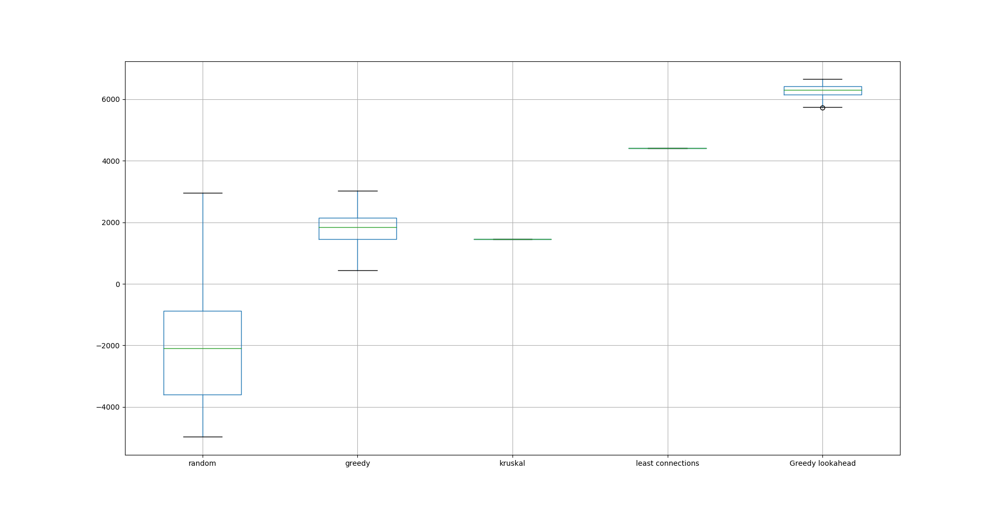

# Heuristieken - All rights reserved

__RAILNL__

Milena van der Velde  
Philip Lankhorst  
Wouter de Boer  

## Probleem

De dienstregeling van de NS voor het treinverkeer in Nederland kan op vele manieren ingevuld worden. Het probleem dat hierbij komt kijken is het vinden van de meest efficiente invulling. De NS heeft een bepaalde scorefunctie die gemaximaliseerd moet worden terwijl alle stations in Nederland met elkaar verbonden moeten zijn binnen een bepaalde tijdsframe. 

### Uitgebreide informatie 

- De lijnvoering: Wat zijn de trajecten waarover de treinen gedurende de dag heen en weer rijden?
- De dienstregeling: hoe laat vertrekken de treinen van de stations over de trajecten?
- Het materieelrooster: welk treinstel en welke wagons zijn op welk moment op welke plaats?
- Het personeelsrooster: zijn alle treinen bemand door tenminste één bestuurder en twee conducteurs?

Deze case gaat over het eerste deel, het maken van de lijnvoering. Meer specifiek: over de lijnvoering van intercitytreinen. Dat betekent dat je binnen een gegeven tijdsframe een aantal trajecten uitzet. Een traject is een route van sporen en stations waarover treinen heen en weer rijden. Een traject mag niet langer zijn dan het opgegeven tijdsframe.

Voorbeeld: Het traject [Castricum , Zaandam , Hoorn , Alkmaar] is een traject met een duur van 59 minuten, en zou dus binnen het tijdsframe van een uur passen.

  
### Proces

Als eerste stap hebben we een random algoritme, [randomize.py](code/algorithms/randomize.py), geschreven, dit gaf geen geweldige resultaten. In het geval van Holland kregen we nog redelijke scores door het te laten lopen tot we een _p_ van 1 gevonden hadden, dit was bij heel Nederland niet het geval. Het random algoritme kiest steeds een willekeurig station en blijft dan willekeurige aansluitende connecties toevoegen tot de maximumtijd van een trein bereikt is.  
Na random probeerden we een [greedy](code/algorithms/greedy.py) algoritme; de code koos de kortste connectie en zocht steeds de kortste nog ongebruikte connectie vanaf het volgende station.  
Op basis van Minimum Spanning Tree theorie probeerden we met het Kruskal-algoritme een oplossing te vinden in [kruskal.py](code/algorithms/kruskal.py), deze had echter een erg lage score. Dit komt doordat Kruskal bedoeld is om de route met de laagste kosten te vinden, zonder daarbij de proportie te maximaliseren. Zo kregen we dus een erg efficiënte route langs alle stations, maar niet een van hoge kwaliteit. Kruskal kiest altijd de kortste connecties en probeert deze vervolgens aan elkaar te verbinden. Zo krijg je dus de 'snelste' verbinding van alle punten, dus een klein aantal minuten, maar vaak het maximale aantal treinen en een lage proportie, wat niet leidt tot een hoge score.  
Om te zorgen dat de stations in de uithoeken (Den Helder, Vlissingen, Enschede) altijd bereikt worden, schreven we vervolgens een algoritme, [least connections](code/algorithms/connectioncount.py), dat steeds het station met de minste connecties koos. Hierdoor kregen we een score van ongeveer 4200. Om deze score te verbeteren schreven we een nieuw algoritme, [iterative deepening](code/algorithms/iterativedeepening.py), waarbij steeds een aantal stations vooruit gekeken wordt en de route met de hoogste marginale kwaliteit gekozen wordt. Dit is een vorma van een iterative deepening depth-first search algoritme, omdat het stap voor stap dieper wordt. Hieronder een boxplot ter vergelijking van de algoritmes, waarbij de iterative deepening 3 stations vooruit kijkt. De boxplots zijn gebaseerd op 250 simulaties per algoritme. 



## Reproduceren

### Vereisten (Prerequisites)

Deze codebase is volledig geschreven in [Python3.7.5](https://www.python.org/downloads/). Alle gebruikte packages staan in requirements.txt, run daarom eerst de volgende regel om de code te reproduceren:

```
pip install -r requirements.txt
```

### Structuur (Structure)

In de map Code staat de python code die we gebruikt hebben om de case op te lossen. In de map Data staan de bestanden die we gebruikt hebben. In Results staat een aantal resultaten en een code om de resultaten in een csv op te slaan. In doc staan afbeeldingen die in dit bestand en onze presentatie gebruikt worden.

### Test (Testing)

Om de code te draaien (na installeren van de requirements) run:

```
python main.py
```

## Auteurs (Authors)

* Milena van der Velde
* Wouter de Boer
* Philip Lankhorst

## Dankwoord (Acknowledgments)

* De docenten en assistenten van de minor programmeren van de UvA
