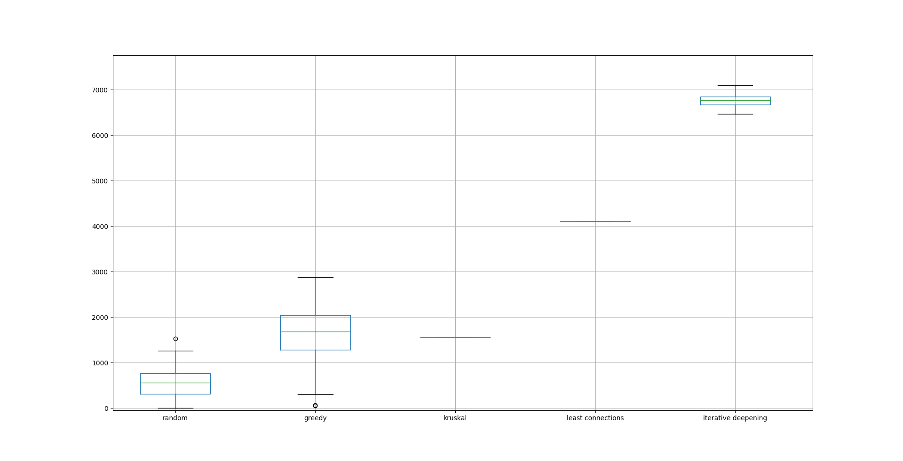

# Heuristieken - All rights reserved

__RAILNL__

Milena van der Velde  
Philip Lankhorst  
Wouter de Boer  

## Probleem

Het treinverkeer in Nederland kan op vele manieren ingevuld worden. Het probleem dat hierbij komt kijken is het vinden van de meest efficiente invulling. De kwaliteit van de lijnvoering wordt bepaald aan de hand van een scorefunctie. Het doel wordt dus het maximaliseren van deze functie: ```K = 10.000*p - (T*100 - MIN)``` p = proportie bereden connecties, T= aantal treining ingezet en MIN = totaal aantal minuten van de trajecten samen. Waarbij er rekening wordt gehouden met het maximaal aantal treinen wat mag worden ingezet en tevens mag een trein niet langer dan een gegeven timeframe onderweg zijn. 
 
### Proces

Als eerste stap hebben we een random algoritme, [randomize.py](code/algorithms/randomize.py), geschreven, dit gaf geen geweldige resultaten. In het geval van Holland kregen we nog redelijke scores door het te laten lopen tot we een _p_ van 1 gevonden hadden, dit was bij heel Nederland niet het geval. Het random algoritme kiest steeds een willekeurig station en blijft dan willekeurige aansluitende connecties toevoegen tot de maximumtijd van een trein bereikt is.  
Na random probeerden we een [greedy](code/algorithms/greedy.py) algoritme; de code koos de kortste connectie en zocht steeds de kortste nog ongebruikte connectie vanaf het volgende station.  
Op basis van Minimum Spanning Tree theorie probeerden we met het Kruskal-algoritme een oplossing te vinden in [kruskal.py](code/algorithms/kruskal.py), deze had echter een erg lage score. Dit komt doordat Kruskal bedoeld is om de route met de laagste kosten te vinden, zonder daarbij de proportie te maximaliseren. Zo kregen we dus een erg efficiënte route langs alle stations, maar niet een van hoge kwaliteit. Kruskal kiest altijd de kortste connecties en probeert deze vervolgens aan elkaar te verbinden. Zo krijg je dus de 'snelste' verbinding van alle punten, dus een klein aantal minuten, maar vaak het maximale aantal treinen en een lage proportie, wat niet leidt tot een hoge score.  
Om te zorgen dat de stations in de uithoeken (Den Helder, Vlissingen, Enschede) altijd bereikt worden, schreven we vervolgens een algoritme, [least connections](code/algorithms/leastconnections.py), dat steeds het station met de minste connecties koos. Hierdoor kregen we een score van ongeveer 4200. Om deze score te verbeteren schreven we een nieuw algoritme, [iterative deepening](code/algorithms/iterativedeepening.py), waarbij steeds een aantal stations vooruit gekeken wordt en de route met de hoogste marginale kwaliteit gekozen wordt. Dit is een vorm van een iterative deepening depth-first search algoritme, omdat het stap voor stap dieper wordt. Hieronder een boxplot ter vergelijking van de algoritmes, waarbij de iterative deepening 3 stations vooruit kijkt. De boxplots zijn gebaseerd op 250 simulaties per algoritme. 



## Reproduceren

### Vereisten (Prerequisites)

Deze codebase is volledig geschreven in [Python3.7.5](https://www.python.org/downloads/). Alle gebruikte packages staan in requirements.txt, run daarom eerst de volgende regel om de code te reproduceren:

```
pip install -r requirements.txt
```

### Structuur (Structure)

In de map Code staat de python code die we gebruikt hebben om de case op te lossen. In het submapje, algorithms, van de map Code is een README.md die de algoritmes verder uitlegt. In de map Data staan de bestanden die we gebruikt hebben. In Results staat een aantal resultaten en een code om de resultaten in een csv op te slaan. In doc staan afbeeldingen die in dit bestand en onze presentatie gebruikt worden.

### Test (Testing)

Om de code te draaien (na installeren van de requirements) run:

```
python main.py
```

## Auteurs (Authors)

* Milena van der Velde
* Wouter de Boer
* Philip Lankhorst

## Dankwoord (Acknowledgments)

* De docenten en assistenten van de minor programmeren van de UvA
